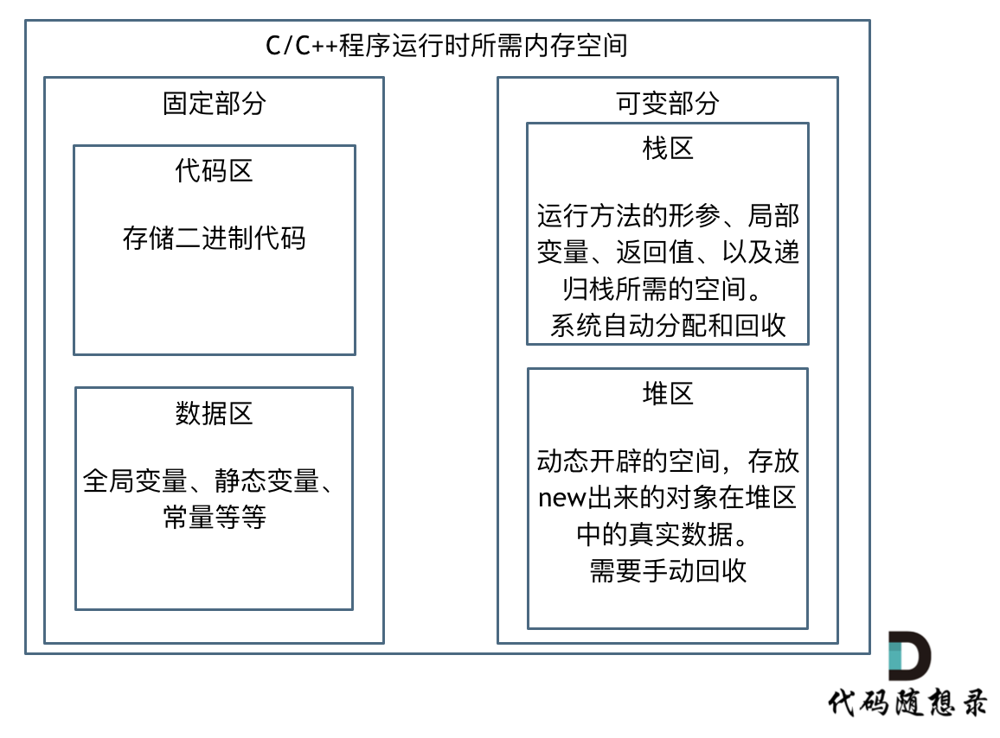

# 代码随想录

## 算法性能分析

### C++内存管理

  程序运行时内存空间分成 固定部分 可变部分
    

### 内存对齐

  1.平台原因：不是所有的硬件平台都能随意访问任意内存地址上的任意数据，某些硬件平台只能在某些地址处取某些特定类型的数据，否则抛出硬件异常。为了同一个程序可以在多平台运行，需要内存对齐

  2.硬件原因：经过内存对齐后，CPU访问内存的速度大大提升
    
    

## 数组

### 数组理论基础

  C++中二维数组在地址空间上是连续的

  Java 没有指针，同时也不对程序员暴露元素的地址

### 二分查找

  给定一个n个元素有序的（升序）整型数组nums和一个目标值target，写一个函数搜索nums中的target，如果目标值存在则返回下标，不存在返回-1。

  1.**nums中的所有元素不重复**

  2.**n在[1,10000]之间**

  3.**nums的每个元素都将在[-9999,9999]之间**

  注意区间定义  不变量
  
  target左闭右闭 [left,right]:
  
  while(left<=right)  left==right有意义，所以使用<=

  if(nums[middle]>target) right==middle-1

  ```C++
  class Solution{
    public:
      int serarch(vector<int>& nums, int target) {
        int left = 0;
        int right = nums.size() - 1;
        while(left <= right) {
          int middle = left + ((right - left)/2);
          if(nums[middle] > target){
            right = middle - 1;
          }else if(nums[middle] < target){
            left = middle + 1;
          }else{
            return middle;
          }
        }
        return -1;
      }
  }
  ```

  时间复杂度 ：O(logn)
  
  空间复杂度 ：O(1)

  如果target左闭右开 [left,right]

  while(left < right) left == right 无意义
  if(nums[middle] > target) right == middle

  ```C++
  class Solution{
    public:
      int search(vector<int>& nums, int target){
        int left = 0;
        int right = nums.size();
        whlie(left < right) {
          int middle = left + ((right - left) >> 1);
          if(nums[middle] > target){
            right = middle;
          }else if(nums[middle] < target) {
            left = middle + 1;
          }else {
            return middle;
          }
        }
        return -1;
      }
  }
  ```
  
  时间复杂度 ：O(logn)

  空间复杂度 ：O(1)

### 移除元素

  给定数组nums和一个值val，需要 原地 移除所有数值等于val的元素，并返回移除后数组的新长度
  
  不能使用额外的数组空间，必须仅使用O(1)额外空间并原地修改输入数组

  元素的顺序可以改变，不需要考虑数组中超出新长度后面的元素

  tip：**数组的元素在内存地址中是连续的，不能单独删除数组中的某个元素，只能覆盖**

#### 暴力解法

  两层for循环，外层遍历数组元素，内层更新数组

  时间复杂度O(n^2) 空间复杂度O(1)

  ```C++
  class Solution{
    public:
      int removeElement(vector<int>& nums, int val) {
        int size = nums.size();
        for(int i = 0;i < size;i++){
          if(nums[i] == val){
            for(int j = i+1; j < size; j++){
              nums[j-1] = nums[j];
            }
            i--;
            size--;
          }
        }
        return size;
      }
  }
  ```

#### 双指针法

  通过一个快指针和慢指针在一个for循环下完成两个for循环的工作

  ·快指针：寻找新数组的元素，新数组就是不含有目标元素的数组

  ·慢指针：指向更新 新数组下标的位置

  ```C++
  class Solution{
    public:
      int removeElement(vector<int>& nums, int val){
        int slowIndex = 0;
        for(int fastIndex = 0; fastIndex < nums.size(); fastIndex++){
          if(val != nums[fastIndex]){
            nums[slowIndex++] = nums[fastIndex];
          }
        }
        return slowIndex;
      }
  }
  ```

  时间复杂度O(n)  空间复杂度O(1)

#### 相向双指针法

基于元素顺序可以改变  改变了元素相对位置，确保了移动最少元素

时间复杂度O(n)  空间复杂度O(1)

```C++
class Solution{
  public:
    int removeElement(vector<int>& nums, int val){
      int leftIndex = 0;
      int rightIndex = nums.size() - 1;
      while(leftIndex <= rightIndex){
        // 找左边等于val的元素
        while(leftIndex <= rightIndex && nums[leftIndex] != val){
          ++leftIndex;
        }
        // 找右边不等于val的元素
        while(leftIndex <= rightIndex && nums[rightIndex] == val){
          --rightIndex;
        }
        // 将右边不等于val的元素覆盖左边等于val的元素
        if(leftIndex < rightIndex){
          nums[leftIndex++] = nums[rightIndex--];
        }
      }
      return leftIndex; // leftIndex一定指向了最终数组末尾的下一个元素
    }
}
```

### 有序数组的平方

一个按 非递减顺序 排序的整数数组nums，返回每个数组的平方组成的新数组，要求也按 非递减顺序 排序

#### 暴力解法

每个数平方后，排序

```C++
class Solution{
  public:
    vector<int> sortedSquares(vector<int>& A){
      for(int i = 0; i < A.size(); i++){
        A[i] *= A[i];
      }
      sort(A.begin(), A.end()); //快排
      return A;
    }
}
```

时间复杂度O(n+nlogn)

#### 双指针法

数组平方的最大值就在数组的两端，不是最左边就是最右边，不在中间。

双指针，i指向起始位置，j指向终止位置

定义新数组result，和A数组一样大，让k指向result数组终止位置

如果`A[i] * A[i] < A[j] * A[j]` 那么`result[k--] = A[j] * A[j]`

如果`A[i] * A[i] >= A[j] * A[j]`那么`result[k--] = A[i] * A[i]`

```C++
class Solution{
  public:
    vector<int> sortedSquares(vector<int>& A){
      int k = A.size() - 1;
      vector<int> result(A.size(), 0);
      for(int i = 0, j = A.size() - 1; i <= j;){
        if(A[i] * A[i] < A[j] * A[j]){
          result[k--] = A[j] * A[j];
          j--;
        }
        else{
          result[k--] = A[i] * A[i];
          i++;
        }
      }
      return result;
    }
}
```

时间复杂度 O(n)

### 长度最小的子数组

给定一个含有n个正整数的数组和一个正整数s，找出该数组中满足其和>=s的长度最小的连续子数组，并返回其长度，如果不存在符合条件的子数组，返回0。

#### 暴力解法

```C++
class Solution{
  public:
    int minSubArrayLen(int s, vector<int>& nums){
      int result = INT32_MAX;
      int sum = 0;
      int subLength = 0;
      for(int i = 0; i < nums.size(); i++){
        sum = 0;
        for(int j = i; j < nums.size(); j++){
          sum += nums[j];
          if(sum >= s){
            subLength = j - i + 1;
            result = result < subLength ? result : subLength;
            break;
          }
        }
      }
      return result == INT32_MAX ? 0 : result;
    }
}
```

时间复杂度 O(n^2)

空间复杂度 O(1)
